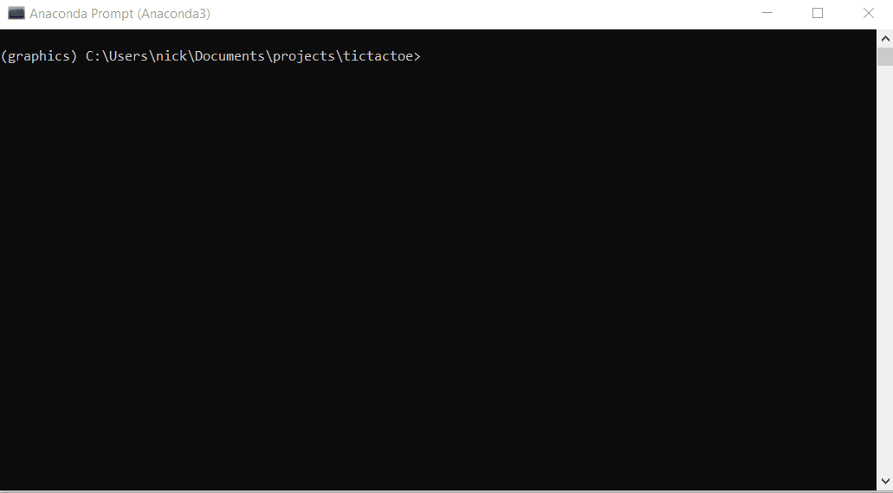
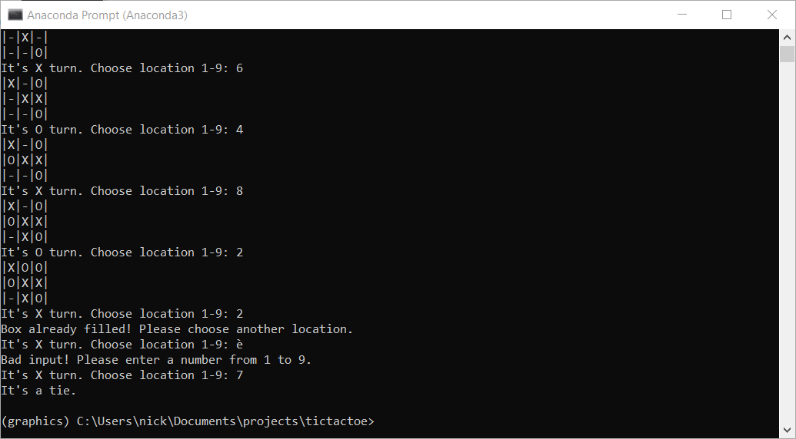

# Tic Tac Toe
This Tic Tac Toe game is build in Python. The user can choose if he/she wants to play the game in the terminal or with a GUI.
The [Arcade library](http://arcade.academy/) was used to code the graphics for the GUI version of the game.

## Run locally
Download or git clone this repository.
It's recommended to create a virtual environment and install the required packages in that environment.
I use [conda](https://docs.conda.io/en/latest/) for environment management.
```
cd tictactoe
conda create -n graphics python=3.7
conda activate graphics
pip install -r requirements.txt
```


Play the game.
```
python app.py
```

## Demo





## Future work
Add some kind of AI to play against the CPU.
