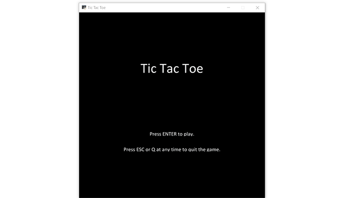

# Tic Tac Toe
This Tic Tac Toe game is build in Python. The user can choose if he/she wants to play the game in the terminal or with a GUI.
The [Arcade library](http://arcade.academy/) was used to code the graphics for the GUI version of the game.

## Run locally
Download or git clone this repository.
Install the necessary packages by using *requirements.txt* .
```
cd tictactoe
pip install -r requirements.txt
```
Play the game.
```
python app.py
```

## Demo





## Future work
Add some kind of AI to play against the CPU.
